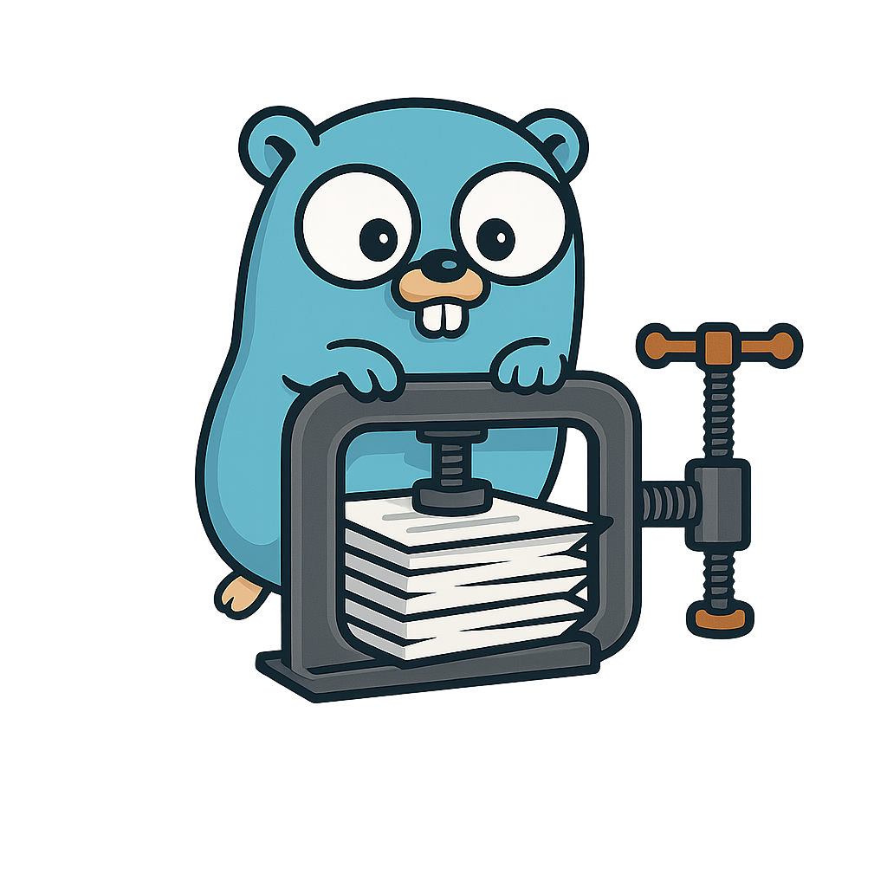

# gocondense



[](https://pkg.go.dev/github.com/abemedia/gocondense)
[](https://codecov.io/gh/abemedia/gocondense)
[](https://github.com/abemedia/gocondense/actions/workflows/test.yml)
[](https://goreportcard.com/report/github.com/abemedia/gocondense)

A configurable Go code formatter that condenses multi-line constructs into single lines where appropriate, improving code density while maintaining readability and respecting specified formatting constraints.

## Features

- **Configurable**: Fine-grained control over which constructs to condense
- **Flexible Limits**: Set maximum line length and key-value pair limits
- **Preserves Comments**: All comments are preserved in their original positions
- **Semantic Safety**: No changes to code semantics or behavior
- **CLI and Library**: Available as both a command-line tool and Go library

## Installation

### Command Line Tool

```bash
go install github.com/abemedia/gocondense/cmd/gocondense@latest
```

### Library

```bash
go get github.com/abemedia/gocondense
```

## Supported Constructs

### Declaration Groups

Condenses single-item declaration groups (import, var, const, type) from multi-line to single-line format.

**Before:**

```go
import (
    "fmt"
)

var (
    x = 1
)

const (
    Name = "value"
)

type (
    ID int
)
```

**After:**

```go
import "fmt"

var x = 1

const Name = "value"

type ID int
```

---

### Unnecessary Parentheses

Removes unnecessary parentheses around simple expressions while preserving those needed for operator precedence.

**Before:**

```go
x := (variable)      // Around identifiers
y := (42)            // Around literals
z := (string)("foo") // Type conversions
nested := ((a))      // Nested parentheses
unary := -(value)    // Simple unary operands
```

**After:**

```go
x := variable      // Around identifiers
y := 42            // Around literals
z := string("foo") // Type conversions
nested := a        // Nested parentheses
unary := -value    // Simple unary operands
```

---

### Function Declarations

Condenses function parameters and return values.

**Before:**

```go
func Add(
    a int,
    b int,
) (
    result int,
    err error,
) {
    return a + b, nil
}
```

**After:**

```go
func Add(a int, b int) (result int, err error) {
    return a + b, nil
}
```

**Supports:**

- Regular function parameters
- Named return values
- Generic type parameters
- Variadic functions

---

### Function Literals (Anonymous Functions)

Condenses function literal signatures.

**Before:**

```go
callback := func(
    x int,
    y int,
) int {
    return x + y
}
```

**After:**

```go
callback := func(x int, y int) int {
    return x + y
}
```

---

### Function Calls

Condenses function call arguments.

**Before:**

```go
result := myFunction(
    arg1,
    arg2,
    arg3,
)

fmt.Printf(
    "Hello %s, you are %d years old",
    name,
    age,
)
```

**After:**

```go
result := myFunction(arg1, arg2, arg3)

fmt.Printf("Hello %s, you are %d years old", name, age)
```

**Supports:**

- Regular function calls
- Method calls
- Variadic arguments (with `...`)

---

### Struct Literals

Condenses struct initialization with named fields.

**Before:**

```go
person := Person{
    Name: "John",
    Age:  30,
    City: "New York",
}
```

**After:**

```go
person := Person{Name: "John", Age: 30, City: "New York"}
```

---

### Slice and Array Literals

Condenses slice and array definitions.

**Before:**

```go
numbers := []int{
    1,
    2,
    3,
    4,
}

fruits := []string{
    "apple",
    "banana",
    "cherry",
}
```

**After:**

```go
numbers := []int{1, 2, 3, 4}

fruits := []string{"apple", "banana", "cherry"}
```

---

### Map Literals

Condenses map initialization.

**Before:**

```go
config := map[string]int{
    "apple":  1,
    "banana": 2,
    "cherry": 3,
}
```

**After:**

```go
config := map[string]int{"apple": 1, "banana": 2, "cherry": 3}
```

---

### Generic Type Parameters

Condenses generic type parameter lists and instantiations.

**Before:**

```go
func GenericFunc[
    T any,
    U comparable,
](
    a T,
    b U,
) T {
    return a
}

// Type instantiation
var result = GenericFunc[
    string,
    int,
]("hello", 42)
```

**After:**

```go
func GenericFunc[T any, U comparable](a T, b U) T {
    return a
}

// Type instantiation
var result = GenericFunc[string, int]("hello", 42)
```

## Command Line Tool

### Basic Usage

Format a single file (modifies in-place):

```bash
gocondense myfile.go
```

Format multiple files:

```bash
gocondense file1.go file2.go file3.go
```

Format all Go files in a directory:

```bash
gocondense ./
```

Format all Go files recursively:

```bash
gocondense ./...
```

Format from stdin to stdout:

```bash
cat myfile.go | gocondense
```

### Configuration Options

| Flag              | Description                                           | Default |
| ----------------- | ----------------------------------------------------- | ------- |
| `--max-len`       | Maximum line length before keeping multi-line         | 80      |
| `--tab-width`     | Width of tab character for length calculation         | 4       |
| `--max-key-value` | Maximum key-value pairs per line for structs and maps | 3       |
| `--enable`        | Comma-separated list of features to enable            | "all"   |
| `--disable`       | Comma-separated list of features to disable           | ""      |

#### Supported Features

- `declarations` - Single-item declaration groups
- `parentheses` - Unnecessary parentheses removal
- `types` - Generic type parameters
- `funcs` - Function declarations
- `literals` - Function literals
- `calls` - Function calls
- `structs` - Struct literals
- `slices` - Slice/array literals
- `maps` - Map literals
- `all` - All features

### Examples

**Only condense specific features:**

```bash
gocondense --enable calls,structs myfile.go
```

**Exclude certain features:**

```bash
gocondense --disable declarations myfile.go
```

**Custom limits:**

```bash
gocondense --max-len 120 --tab-width 2 --max-key-value 5 myfile.go
```

## Go Library

### Getting Started

```go
package main

import (
    "fmt"
    "log"

    "github.com/abemedia/gocondense"
)

func main() {
    sourceCode := []byte(`
func add(
    a int,
    b int,
) int {
    return a + b
}`)

    // Using default configuration
    formatted, err := gocondense.Format(sourceCode)
    if err != nil {
        log.Fatal(err)
    }

    fmt.Println(string(formatted))
    // Output: func add(a int, b int) int { return a + b }
}
```

### Custom Configuration

```go
package main

import (
    "fmt"
    "log"

    "github.com/abemedia/gocondense"
)

func main() {
    config := &gocondense.Config{
        MaxLen:      120,            // Allow longer lines
        MaxKeyValue: 5,              // Allow up to 5 key-value pairs per line
        TabWidth:    4,              // Tab width for length calculation
        Enable:      gocondense.All, // Enable all features
    }

    formatter := gocondense.New(config)
    formatted, err := formatter.Format(sourceCode)
    if err != nil {
        log.Fatal(err)
    }

    fmt.Println(string(formatted))
}
```

### Feature Selection

```go
// Enable only specific features
config := &gocondense.Config{
    MaxLen: 80,
    Enable: gocondense.Funcs | gocondense.Calls, // Only functions and calls
}

// Enable all except declarations
config := &gocondense.Config{
    MaxLen: 80,
    Enable: gocondense.All &^ gocondense.Declarations, // All except declarations
}
```
