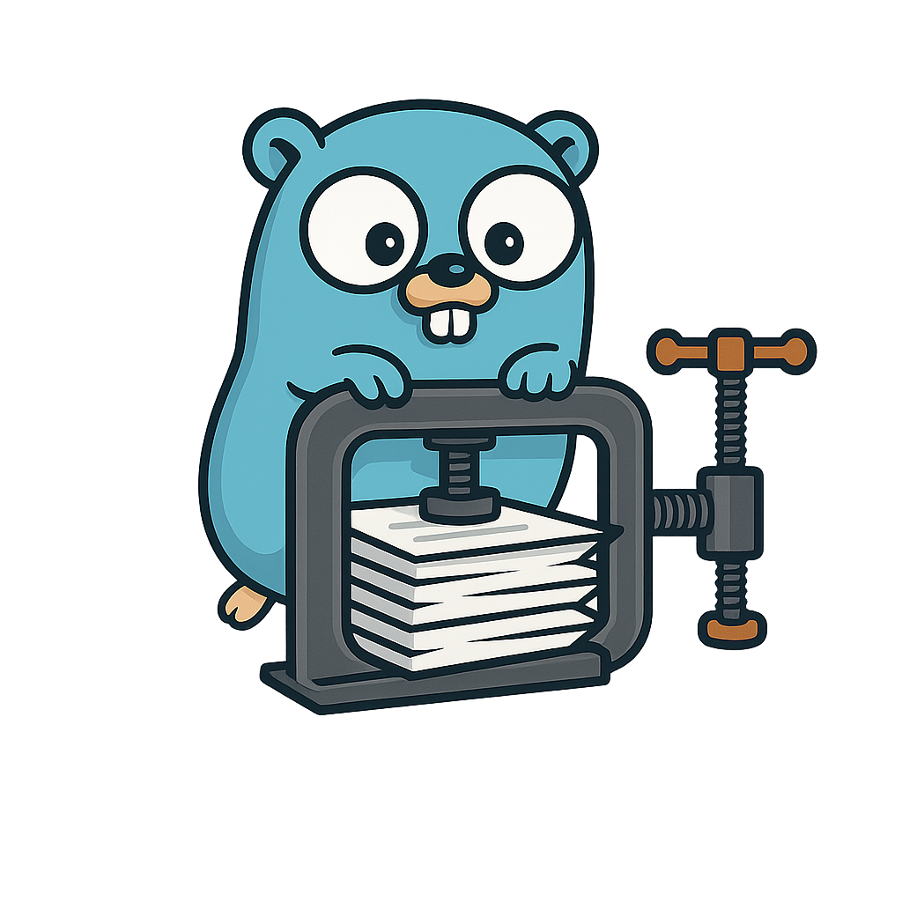

# gocondense



[](https://pkg.go.dev/github.com/abemedia/gocondense)
[](https://codecov.io/gh/abemedia/gocondense)
[](https://github.com/abemedia/gocondense/actions/workflows/ci.yml)
[](https://goreportcard.com/report/github.com/abemedia/gocondense)

A Go source code formatter that condenses multi-line constructs onto single
lines where they fit, reducing vertical noise while preserving readability.  
All transformations are line-length aware (default 80 columns), idempotent, and
preserve all comments.

## Installation

```bash
go install github.com/abemedia/gocondense/cmd/gocondense@latest
```

## Usage

```bash
gocondense file1.go file2.go      # format files in-place
gocondense ./                     # format all .go files in a directory
gocondense ./...                  # format all .go files recursively
cat file.go | gocondense          # read from stdin, write to stdout
```

Files are modified in-place. Generated files, `vendor` and `testdata`
directories, as well as paths listed in `go.mod` `ignore` directives are skipped
unless explicitly specified as arguments.

| Flag          | Description                                                             | Default |
| ------------- | ----------------------------------------------------------------------- | ------- |
| `--max-len`   | Maximum line length; constructs exceeding this remain on multiple lines | 80      |
| `--tab-width` | Tab character width used for line length calculation                    | 4       |
| `-l`          | List files whose formatting differs (exit 1 if any)                     |         |
| `-d`          | Display diffs instead of rewriting files (exit 1 if any)                |         |

## Transformations

<details><summary><b>Condense function signatures</b></summary>

Multi-line parameter lists, return types, and type parameter lists are condensed
onto single lines. Each part is condensed independently — for example,
parameters with comments remain multi-line while return types are still
condensed.

```go
func Add[
    T ~int,
](
    a T,
    b T,
) (
    result T,
    err error,
) {
    return a + b, nil
}
```

```go
func Add[T ~int](a, b T) (result T, err error) {
    return a + b, nil
}
```

Partial condensing when parameters contain comments:

```go
func Partial[
    T any,
](
    a T, // keep
    b string,
) (
    string,
    error,
) {
    return "", nil
}
```

```go
func Partial[T any](
    a T, // keep
    b string,
) (string, error) {
    return "", nil
}
```

</details>

<details><summary><b>Condense function calls</b></summary>

Multi-line argument lists are condensed onto a single line. When the last
argument is multiline, leading arguments are condensed onto the first line and
the closing parenthesis is pulled up. Calls are left untouched if any argument
other than the last is multiline.

```go
result := myFunction(
    arg1,
    arg2,
    arg3,
)
```

```go
result := myFunction(arg1, arg2, arg3)
```

Trailing multiline argument:

```go
processData(
    people,
    func(p Person) bool {
        return p.Age >= 18
    },
)
```

```go
processData(people, func(p Person) bool {
    return p.Age >= 18
})
```

</details>

<details><summary><b>Condense slice, array, and unkeyed struct literals</b></summary>

Slice, array, and unkeyed struct literals are condensed onto a single line,
provided all elements are single-line.

```go
numbers := []int{
    1,
    2,
    3,
}
```

```go
numbers := []int{1, 2, 3}
```

</details>

<details><summary><b>Condense keyed struct and map literals</b></summary>

Keyed literals are only condensed when the first element already shares a line
with the opening brace.

Condensed (first element on brace line):

```go
p := Person{Name: "John",
    Age: 30,
}
```

```go
p := Person{Name: "John", Age: 30}
```

Left untouched (first element on its own line):

```go
p := Person{
    Name: "John",
    Age:  30,
}
```

</details>

<details><summary><b>Condense expressions</b></summary>

Binary expressions, selector chains, and generic type instantiations that span
multiple lines are condensed onto a single line, provided both sides of the
expression are single-line.

```go
_ = a +
    b

_ = obj.
    Method

_ = g[
    int, string](1, "a")
```

```go
_ = a + b

_ = obj.Method

_ = g[int, string](1, "a")
```

</details>

<details><summary><b>Unwrap single-item declaration groups</b></summary>

Declaration groups (`import`, `const`, `var`, `type`) containing a single item
are unwrapped onto a single line without parentheses. Groups with comments
inside are left untouched.

```go
import (
    "fmt"
)

const (
    x = 1
)

var (
    y = 2
)

type (
    S struct{}
)
```

```go
import "fmt"

const x = 1

var y = 2

type S struct{}
```

</details>

<details><summary><b>Group adjacent parameters with the same type</b></summary>

Adjacent type parameters or function parameters and results with the same type
are merged into a single declaration.

```go
func foo(a int, b int) (c int, d int) { return a, b }

type Pair[A any, B any] struct{}
```

```go
func foo(a, b int) (c, d int) { return a, b }

type Pair[A, B any] struct{}
```

</details>

<details><summary><b>Remove unnecessary parentheses</b></summary>

Redundant parentheses around variables, literals, type conversions, and unary
expressions are removed. Parentheses required for precedence are preserved.

```go
x := (variable)
y := (42)
z := (string)("foo")
unary := -(value)
result := (a + b) * c // kept
```

```go
x := variable
y := 42
z := string("foo")
unary := -value
result := (a + b) * c // kept
```

</details>

<details><summary><b>Trim leading and trailing blank lines</b></summary>

Leading and trailing blank lines are removed from all delimited constructs,
including function bodies, case clauses, composite literals, struct and
interface definitions, parameter lists, and declaration groups.

Function bodies:

```go
func foo() {

    bar()

}
```

```go
func foo() {
    bar()
}
```

Case clauses:

```go
switch {
case true:

    x := 1

}
```

```go
switch {
case true:
    x := 1
}
```

Composite literals:

```go
_ = map[string]int{

    "a": 1,

}
```

```go
_ = map[string]int{
    "a": 1,
}
```

</details>

<details><summary><b>Remove blank lines after assignment operators</b></summary>

Blank lines between an assignment operator (`:=` or `=`) and the value are
removed. When a comment appears between the operator and the value, blank lines
are removed but the comment is preserved on its own line.

```go
a :=
    1

var b =

// comment
2
```

```go
a := 1

var b =
// comment
2
```

</details>

<details><summary><b>Collapse empty blocks</b></summary>

Empty function bodies, struct definitions, and interface definitions are
collapsed onto a single line.

```go
func noop() {
}

type S struct {
}

type I interface {
}
```

```go
func noop() {}

type S struct{}

type I interface{}
```

</details>

<details><summary><b>Elide redundant types in composite literals</b></summary>

Redundant type names in composite literals are removed.

```go
_ = []T{T{1, 2}, T{3, 4}}
_ = []*T{&T{1, 2}, &T{3, 4}}
_ = map[T]T{T{1, 2}: T{3, 4}}
```

```go
_ = []T{{1, 2}, {3, 4}}
_ = []*T{{1, 2}, {3, 4}}
_ = map[T]T{{1, 2}: {3, 4}}
```

</details>

<details><summary><b>Remove redundant len calls and zero bounds in slices</b></summary>

Redundant `len` calls and zero low bounds are removed from slice expressions.
Three-index slices, expressions with side effects, and explicit non-zero bounds
are left untouched.

```go
_ = s[1:len(s)]
_ = s[0:]
```

```go
_ = s[1:]
_ = s[:]
```

Left untouched:

```go
_ = s[0:2]              // explicit non-zero high bound
_ = s[0:len(s):cap(s)]  // three-index slice
_ = f()[0:len(f())]     // side effects
```

</details>

<details><summary><b>Remove blank identifiers in range statements</b></summary>

Unnecessary blank identifiers are removed from range statements.

```go
for i, _ := range s { /* ... */ }
```

```go
for i := range s { /* ... */ }
```

And:

```go
for _ = range s { /* ... */ }
```

```go
for range s { /* ... */ }
```

</details>

## Editor Integration

### VS Code

Add the following to your
[settings](https://code.visualstudio.com/docs/getstarted/settings):

```json
{
  "go.formatTool": "custom",
  "go.alternateTools": {
    "customFormatter": "gocondense"
  }
}
```

### GoLand

1. Open **Settings** > **Tools** > **File Watchers** and add a **Custom**
   template.
2. Configure as follows:

| Field                 | Value              |
| --------------------- | ------------------ |
| **Program**           | `gocondense`       |
| **Arguments**         | `$FilePath$`       |
| **Output path**       | `$FilePath$`       |
| **Working directory** | `$ProjectFileDir$` |

Disable all checkboxes in the **Advanced** section.

### Vim

With [vim-go](https://github.com/fatih/vim-go):

```vim
let g:go_fmt_command = "gocondense"
```

Without vim-go, format on save can be configured with an autocommand:

```vim
autocmd BufWritePre *.go silent execute '%!gocondense'
```

### Neovim

With [conform.nvim](https://github.com/stevearc/conform.nvim):

```lua
require("conform").setup({
  formatters_by_ft = {
    go = { "gocondense" },
  },
  formatters = {
    gocondense = {
      command = "gocondense",
      stdin = true,
    },
  },
})
```

## Using as a Library

```bash
go get github.com/abemedia/gocondense@latest
```

Format a source file with default settings (80 columns, 4-wide tabs):

```go
formatted, err := gocondense.Source(src)
```

Use a custom configuration:

```go
f := gocondense.New(gocondense.Config{
    MaxLen:   120,
    TabWidth: 2,
})
formatted, err := f.Source(src)
```

See the [Go Reference](https://pkg.go.dev/github.com/abemedia/gocondense) for
full API documentation.
